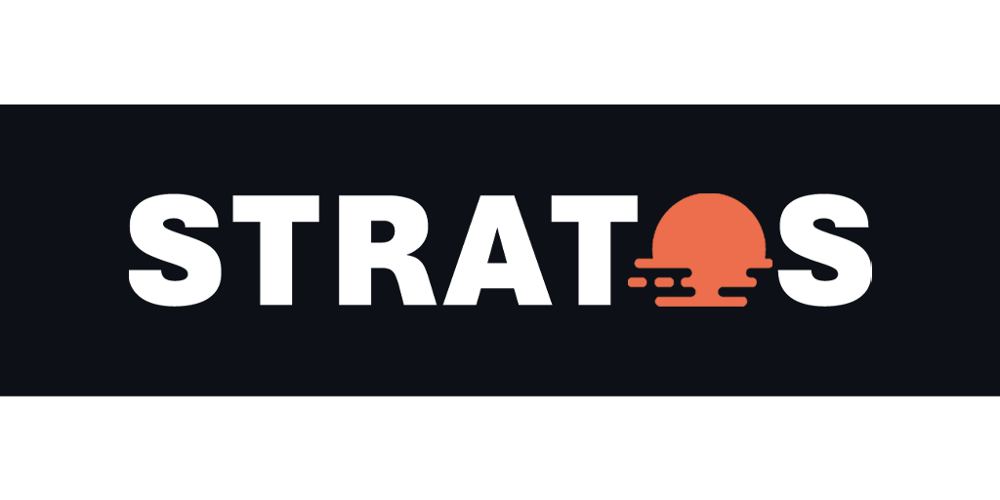

# Stratos Smart Weather Monitor

**Video Demonstration (YouTube):** [get your popcorn](https://www.youtube.com/watch?v=xvFZjo5PgG0)

---

## Omega Project Introduction

Weather affects our lives in countless ways — from our mood and clothes to our productivity and even financial decisions. Our project brings this influence to the forefront with a **smart indoor/outdoor weather station** that displays environmental data on an **M5Stack IoT device** and remotely through a **Streamlit-based web dashboard**.

The project integrates:
- **M5Stack Core2** with display and microphone/speaker
- **Environmental sensors** (temperature, humidity, air quality, motion)
- **Google Cloud Platform (BigQuery + Cloud Functions)**
- **OpenWeatherMap API** for outdoor data and forecasts
- **Text-to-Speech** alerts triggered by motion
- **Historical data** storage and visualization

---

## Deployment Guide

### Prerequisites

- A Google Cloud Platform (GCP) project with:
  - BigQuery enabled
  - Cloud Functions enabled
  - Text-to-Speech API enabled
- An OpenWeatherMap API key
- M5Stack Core2 with:
  - ENVIII Sensor (I2C)
  - Air Quality Sensor (ADC)
  - PIR Motion Sensor (GPIO)
- Internet access (2.4GHz WiFi)
- Python 3.10+
- [Streamlit](https://streamlit.io) for the cloud dashboard

### Steps to follow

- Download the code
- add your google cloud creditentials json at the root of the project
- modifie the .env file with your informations
- run the app.py file in the middleware folder
- run the dasboard.py file with the command "streamlit run dashboard.py" on the dashboard folder
- run the M5 code on UIflow while having your M5 connected

---

### Project Structure

  
<strong>M5Stack Device Setup</strong>

  In order to run the code correctly on the M5Stack Core2, you need to make sure the device is **connected to Wi-Fi at startup**.
  
  #### Wi-Fi Setup
  
  The devices used during the demo have already been configured with credentials for:
  - Team members' **home Wi-Fi**
  - **iot-unil** Wi-Fi
  
  Depending on your current location, follow these steps to select the correct network:
  
  1. **Power on the M5Stack device** while **continuously holding the middle (B) button**.
  2. Go to the **Settings Menu**.
  3. Navigate to the **Wi-Fi Settings** and select the appropriate network:
     - For EPFL/UNIL: choose `iot-unil`
     - For home use: choose the corresponding preconfigured Wi-Fi or configure it yourself using the web configurator
  
  #### Running MicroPython Code via UIFlow
  
  1. Go to [https://flow.m5stack.com/](https://flow.m5stack.com/)
  2. On the **bottom left corner**, input the **API key** displayed on your M5Stack device
  3. Wait until the connection is established
  4. Copy and paste the contents of the MicroPython file (`main.py`) into the **Python tab** on the right
  5. Click **Run** to execute the code
  
  > **Disclaimer**: If the device cannot connect to Wi-Fi at boot, it may freeze due to sensor initialization. In that case:
  > - Temporarily **disconnect the TVOC sensor** (Air Quality, connected to port C)
  > - Restart the device
  > - Once the device is connected to the website, **reconnect the sensor**
  
  #### Device Operating Modes
  
  The device supports **three display modes**, selectable via physical buttons:
  
  | Button | Mode      | Description                                                                 |
  |--------|-----------|-----------------------------------------------------------------------------|
  | Left   | **Indoor**  | Shows sensor readings: temperature, humidity, pressure, and air quality     |
  | Middle | **Outdoor** | Shows external weather data (temperature, humidity, pressure) via OpenWeather API |
  | Right  | **Forecast**| Displays current + next 5 days forecast using OpenWeatherMap API           |

  
<strong>Google Cloud Deployment</strong>
 

  
<strong>Streamlit Dashboard</strong>
 

---

## Team Members & Contributions
| Name         | Role & Contribution                                                             |
| ------------ | ------------------------------------------------------------------------------- |
| Thibault Liaudat | M5Stack firmware (MicroPython), integration with sensors and OpenWeatherMap API, UX/UI design (on-device layout and Streamlit), repo structuring, README/video |
| Théo Favey   | Google Cloud deployment (BigQuery, Cloud Functions), text-to-speech automation,  Streamlit dashboard (visualization, filtering, historical insights)  |

